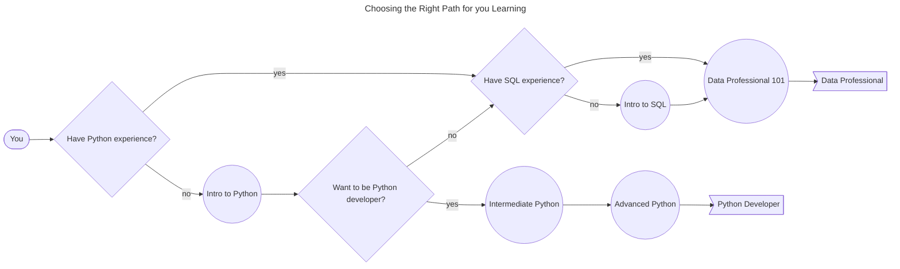
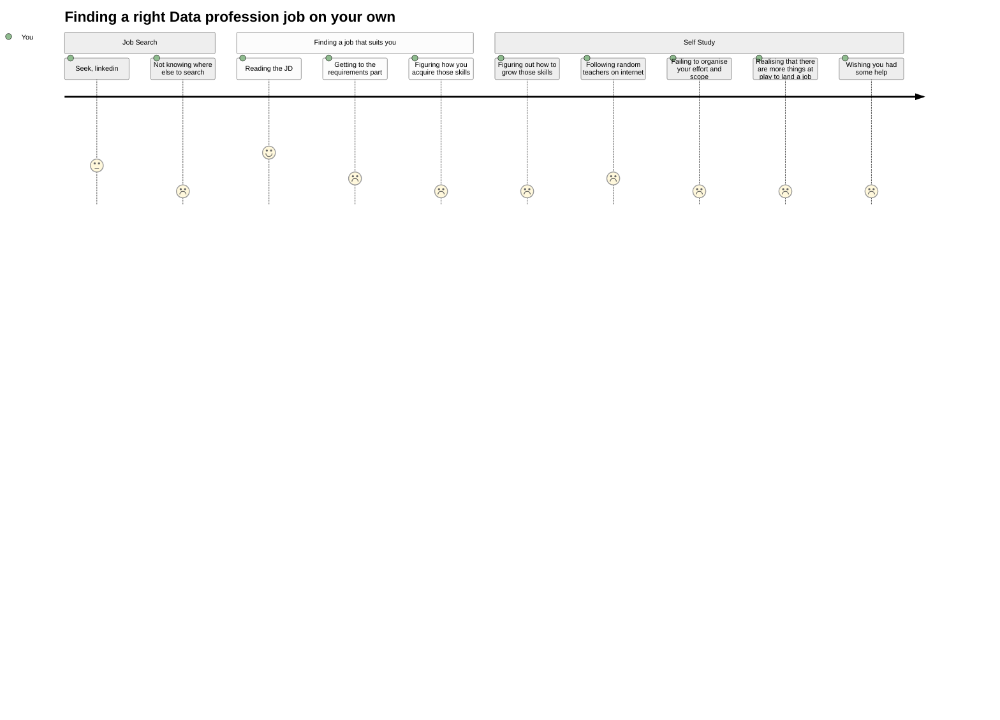
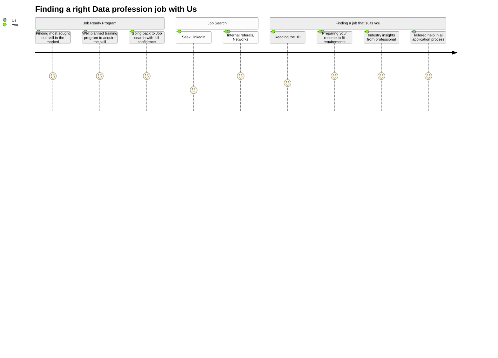

## Flow-Chart for Course Selection

```mermaid
---
title: Choosing the Right Path for you Learning
---
flowchart LR
    startbox([You])
    knowpython{Have Python experience?}
    data101((Data Professional 101))
    pyt101((Intro to Python))
    pythondev{Want to be Python developer?}
    knowsql{Have SQL experience?}
    pyt102((Intermediate Python))
    pyt103((Advanced Python))
    sql101((Intro to SQL))
    PD>Python Developer]
    DP> Data Professional]

    startbox --> knowpython
    knowpython -->|yes| knowsql
    knowpython -->|no| pyt101 
    pyt101 --> pythondev
    pythondev -->|yes| pyt102
    pythondev -->|no| knowsql
    knowsql -->|yes| data101
    knowsql -->|no| sql101
    sql101 --> data101
    pyt102 --> pyt103
    pyt103 --> PD
    data101 --> DP

```

```mermaid
%%{init: {'theme':'neutral'}}%%
journey
    title Finding a right Data profession job on your own
    
    section Job Search
      Seek, linkedin: 3: You
      Not knowing where else to search: 1: You

    section Finding a job that suits you
      Reading the JD: 4: You
      Getting to the requirements part: 2: You
      Figuring how you acquire those skills: 1: You
    
    section Self Study
        Figuring out how to grow those skills: 1: You
        Following random teachers on internet: 2: You
        Failing to organise your effort and scope: 1: You
        Realising that there are more things at play to land a job: 1: You
        Wishing you had some help: 1: You
```

```mermaid
%%{init: {'theme':'neutral'}}%%
journey
    title Finding a right Data profession job with Us
    section Job Ready Program
        Finding most sought out skill in the marked: 5: Us
        Well planned training program to acquire the skill: 5: Us
        Going back to Job search with full confidence: 5: You

    section Job Search
      Seek, linkedin: 3: You
      Internal referals, Networks: 5: You, Us

    section Finding a job that suits you
      Reading the JD: 4: You
      Preparing your resume to fit requirements: 5: You, Us
      Industry insights from professional: 5: You
      Tailored help in all application process: 5: Us
    
    
```